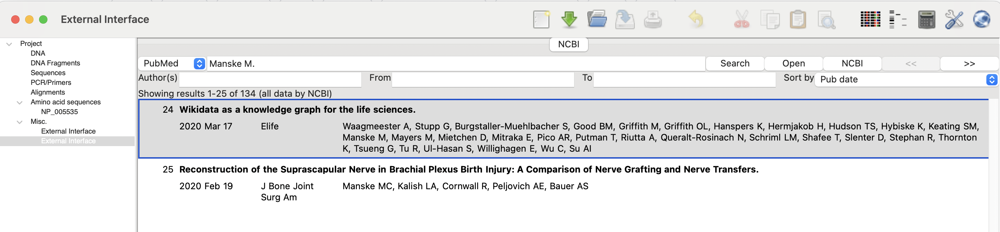
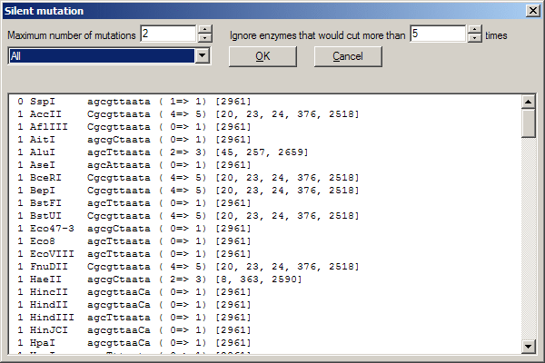

= The Manual
v1.9.4, 2005-03-01
:description: Manual accompanying the GENtle software for molecular biology.
:license-url: https://www.gnu.org/licenses/fdl.en.html
:license-title: GFDL
:idprefix:
:idseparator: -
:doctype: book


[abstract]
== About

GENtle is an open-source molecular biology software available at link:https://github.com/GENtle-persons/gentle-m[GENtle on GitHub]. Distinguished as the sole software of its kind:

- It is governed by an Open Source license.
- It stands apart from platforms where you submit your data via a <<web-interface,web interface>>.

Originating in the early years of this millennium, GENtle provides a valuable resource despite the acknowledged smoother user experiences offered by commercially available alternatives in routine tasks related to cloning.
Still, in our humble opinion, GENtle has a competitive edge in
- representing how all data somehow belongs together
- integrating local tools and databases for the analysis
and obviously it is basically unbeatable for integrating anything novel since it is Open Source.

For users seeking alternative solutions, the following commercial platforms are noteworthy:

- link:https://vectorbuilder.com[VectorBuilder]
- link:https://www.origene.com[OriGene]
- link:https://snapgene.com[SnapGene]
- link:https://benchling.com[Benchling]

These platforms offer extensive lists of cloning vectors with annotations. VectorBuilder goes a step further by enabling users to construct their own vectors.

We encourage the GENtle community to actively contribute by sharing insights into functionalities present in competing products that they wish to see implemented in GENtle.
Feel free to open an issue on link:https://github.com/GENtle-persons/gentle-m/issues[GENtle's GitHub repository] to share your thoughts and suggestions.
Maybe there is a chance you can contribute to GENtle in your Bachelor or Master thesis. 

=== Conventions

1. Keys are marked as monospace `like this`.
2. Menus, Buttons etc. are marked as italic _like this_ .
3. "Double click" always refers to the left mouse button
4. "Context menu" always refers to the popup menu that appears on clicking with the right mouse button

For some honorable historic reasons dating from when Wikis were the very latest thing and the world did not yet know about distributed version management of even of GitHub, this manual instead of internal references refers to a https://en.wikibooks.org/wiki/GENtle[Wiki Book's] chapter that presents the same content. This will change over time towards regular internal references with the one too the book in parentheses.

=== Copyright

GENtle is ©2004 by Magnus Manske, licensed under GPL.

This manual is ©2004 by its authors, licensed under GFDL.

== Project Tree

The initial contact with GENtle is made with the the tree to the left of the program window. It lists all the data types that GENtle is prepared to work with, and this document has the very same structure, describing

1. <<dna,DNA>>
2. DNA fragments and their <<ligation,Ligation>>
3. <<sequencing,Sequencing>>
4. <<pcr-and-primer-design,PCR/Primers>>
5. <<alignments,Alignments>>
6. Amino acid sequences / <<protein,Proteins>>
7. Other smallish bits and pieces

== DNA

.DNA module

//depth="6.152cm"

Within the DNA module, DNA sequences can be viewed, edited and annotated. It is the central module of GENtle.
Two major components of the DNA module are the <<dna-map,DNA map>> (https://en.wikibooks.org/wiki/GENtle/DNA_map[Wiki book]) and the <<sequence-map,Sequence map>> (https://en.wikibooks.org/wiki/GENtle/Sequence_map[Wiki book]); follow the respective link for details.

=== Open and display DNA

A DNA sequence can be opened in one of the following ways:

1. Open from a <<database>> (http://en.wikibooks.org/wiki/GENtle/Databases[Wiki book])
2. <<import,Import>> (http://en.wikibooks.org/wiki/GENtle/Import[Wiki book]) from file 
3. Entering sequence <<enter-sequence,manually>> (http://en.wikibooks.org/wiki/GENtle/Enter_sequence[Wiki book])
4. Create from another DNA module

To reproduce the screenshot of the DNA module via file input perform the following:

1. Download the GenBank entry https://www.ncbi.nlm.nih.gov/nuccore/U13852[U13852], i.e., the pGEX-3X cloning vector:
   - Visit that URL
   - Select "Send to:" -> ("Complete Record","File") which yields a file "sequence.db" in your download folder.
2. In GENtle use "File" -> "Import" and select that file.

It is a general concept of GENtle that routines that generate a new sequence will have that sequence shown next to other sequences that are already in the project. This works also across different sequence types. An open reading frame that gets translated will spawn a new amino acid sequence. An endonuclease applied to a DNA will yield DNA fragments - which may have sticky ends and thus are treated not as regular DNA sequences. The above referenced GenBank entry on the https://www.ncbi.nlm.nih.gov/nuccore/U13852[pGEX-3X cloning vector] will be the origin of several graphs throughout this manual.

=== Toolbar

Several functions and display options can be invoked in the tool bar:

1. Enter sequence
2. Open sequence
3. Save sequence
4. Undo
5. Cut
6. Copy
7. Paste
8. Toggle linear/circular
9. Show/hide open reading frames
10. Show/hide features
11. Show/hide restriction sites
12. Expand (=show only) map
13. Toggle edit mode
14. Zoom

=== Detail tree

The detail tree, left of the DNA map, shows all parts of the current sequence, including features and restriction enzymes, in a structured fashion.
Features and restriction enzymes can be toggled in visibility by a double click, or further manipulated through the context menu.

=== Special menus

.Features of special menu.
[cols="1,2"]
|===
|View/Show 3'-&gt;5' |Show the complementary DNA strand in the sequence map
|Edit/Edit ORFs |Change the settings for open reading frame display
|Edit/Show possible sequencing primers |Opens the http://en.wikibooks.org/wiki/GENtle:Sequencing_Primers[Sequencing Primers] dialog, which can add possible sequencing primers as features
|Edit/Remove sequencing primers |Removes all sequencing primers generated by the above function from the sequence
|Edit/ http://en.wikibooks.org/wiki/GENtle/Automatic_annotation[Auto-annotate] sequence |Finds features from common vectors and other databases in the current sequence
|File/Print map |Prints the http://en.wikibooks.org/wiki/GENtle/DNA_map[DNA map]
|File/Print sequence |Prints the http://en.wikibooks.org/wiki/GENtle/Sequence_map[Sequence map]
|File/Print report |Prints a brief overview. See http://en.wikibooks.org/wiki/GENtle/Printing[Printing]
|===

=== DNA map

.DNA map

//width="8.501cm" depth="5.896cm"

The DNA map is shown for DNA sequences (though a variant is also used in the <<protein,protein module>> (http://en.wikibooks.org/wiki/GENtle/Protein[Wiki book]) for the schematics display).
It shows the linear or circular (e.g., plasmid) DNA sequence as a map.

=== Display

The contents of the menu depends on what object in the map you clicked on.
Also, depending on the properties of the object, some functions might not be available, for example, amino acids of a feature with no reading frame.

==== Background

.Functions available with clicks at the background
[cols="1,2"]
|===
|Edit sequence |Opens the <<sequence-editor,sequence editor>> (http://en.wikibooks.org/wiki/GENtle/Sequence_editor[Wiki book])
|Transform sequence |Make sequence inverted and/or complementary
|Limit enzymes |Limits enzymes to thos that cut no more than _n_ times
|PCR/PCR |Starts the <<pcr-and-primer-design,PCR module>> (http://en.wikibooks.org/wiki/GENtle/PCR_and_Primer_Design[Wiki book])
|PCR/Forward |Starts the <<pcr-and-primer-design,PCR module>> (http://en.wikibooks.org/wiki/GENtle/PCR_and_Primer_Design[Wiki book]) and generates a 5'-&gt;3'-primer
|PCR/Backward |Starts the <<pcr-and-primer-design,PCR module>> (http://en.wikibooks.org/wiki/GENtle/PCR_and_Primer_Design[Wiki book]) and generates a 5'-&gt;3'-primer
|PCR/Both |Starts the <<pcr-and-primer-design,PCR module>> (http://en.wikibooks.org/wiki/GENtle/PCR_and_Primer_Design[Wiki book]) and generates both primers
|PCR/Mutation |Starts the <<pcr-and-primer-design,PCR module>> (http://en.wikibooks.org/wiki/GENtle/PCR_and_Primer_Design[Wiki book]) and generates overlapping mutagenesis primers
|Selection/Cut |Removes the selected part of the sequence and puts it into the clipboard
|Selection/Copy |Copys the selected part of the sequence into the clipboard
|Selection/Copy to new sequence |Genetate a new DNA sequence entry based on the selection
|Selection/Show enzymes that cut here |Opens a variant of the <<silent-mutation,Silent Mutagenesis>> (http://en.wikibooks.org/wiki/GENtle/Silent_Mutagenesis[Wiki book]) dialog for the selected part of the sequence
|Selection/Selection as new feature |Generates a new feature for the selected part of the sequence
|Selection/Extract amino acids |Extracts the amino acid sequence of the selected part of the DNA sequence
|Selection/BLAST amino acids |Runs a BLAST search for the amino acid sequence of the selected part of the DNA sequence
|Selection/BLAST DNA |Runs a BLAST search for the selected part of the DNA sequence
|Sequence map/Save as image |Saves the DNA map as an image file
|Sequence map/Copy image to clipboard |Copies the DNA map as a bitmap or WMF (see http://en.wikibooks.org/wiki/GENtle/Options[Options]) to the clipboard
|Sequence map/Print map |Prints the DNA map
|Show/hide ORFs |Toggles the open reading frame display
|Edit ORFs |Adjusts the open reading frame display
|===

==== Restriction sites

.Functions available for restriction sites
[cols="1,2"]
|===
|Edit restriction enzyme |Add/remove/manage restriction enzyme via the<<sequence-editor,Sequence editor>> (http://en.wikibooks.org/wiki/GENtle/Sequence_editor[Wiki book])
|Show/hide enzyme |Toggle visibility for the enzyme (this will affect all restriction sites for that enzyme in this sequence)
|Remove enzyme |Remove the enzyme from the current selection (this will affect all restriction sites for that enzyme in this sequence).This will not work for automatically added enzymes (see http://en.wikibooks.org/wiki/GENtle/Options#Enzyme_settings[Options])
|Mark restriction site |Marks the recognition sequence of that enzyme at that restriction site
|Mark and show restriction site |Marks the recognition sequence of that enzyme at that restriction site and shows it in the sequence
|Online enzyme information |Opens the http://rebase.neb.com/rebase/rebase.html[ReBase] page for that enzyme
|Add to cocktail |This adds the enzyme to the restriction cocktail (see <<restriction-assistant,Restriction Assistant>> (http://en.wikibooks.org/wiki/GENtle/Restriction_Assistant[Wiki book])) and starts the restiction
|===

==== Features

.Functions available for DNA/amino acid features
[cols="1,1,2"]
|===
|Edit feature |Edit feature properties |(see <<sequence-editor,Sequence editor>> (http://en.wikibooks.org/wiki/GENtle/Sequence_editor[Wiki book]))
|Hide feature | |Hide the feature from display
|Delete feature | |Delete the feature
|DNA Sequence |Mark feature sequence |Mark the DNA sequence that matches the feature
|DNA Sequence |Mark and show feature sequence |Mark the DNA sequence that matches the feature and shows it in the sequence
|DNA Sequence |Copy (coding) DNA sequence |Copies the DNA sequence that matches the feature to the clipboard
|DNA Sequence |This feature as new sequence |Generates a new DNA sequence based on the feature
|DNA Sequence |BLAST DNA|Runs a BLAST search for the DNA of the feature
|Amino acid sequence |Copy amino acid sequence |Copies the amino acid sequence of the feature to the clipboard
|Amino acid sequence |As new entry |Generates a new protein entry based on the amino acid sequence of the feature
|Amino acid sequence |Blast amino acids |Runs a BLAST search for the amino acid sequence of the feature
|===

==== Open reading frames (ORFs)

.Functions available for Open Reading Frames
[cols="1,1,2"]
|===
|As new feature | |Generate a new feature from the ORF, with the appropriate reading frame and direction
|DNA sequence |Copy DNA sequence |Copies the DNA sequence of the ORF to the clipboard
|DNA sequence |As new DNA |Generates a new DNA sequence entry based on the DNA sequence of the ORF
|DNA sequence |BLAST DNA |Runs a BLAST search for the DNA sequence of the ORF
|Amino acid sequence |Copy amino acid sequence |Copies the amino acid sequence of the ORF to the clipboard
|Amino acid sequence |As new AA |Generates a new protein entry based on the amino acid sequence of the ORF
|Amino acid sequence |BLAST amino acids |Runs a BLAST search for the amino acid sequence of the ORF
|===

=== Sequence map

.Sequence map

//width="8.501cm" depth="5.64cm"

The sequence map is used by most GENtle modules.
It shows sequences of DNA or amino acids, as well as primers, features, restriction sites and more.
The basic behaviour, however, is always similar.

=== Clicks

A double click usually opens the <<sequence-editor,editor>> (http://en.wikibooks.org/wiki/GENtle/Sequence_editor[Wiki book]) for the sequence.

=== Context menu

The available functions in the context menu vary with the module the sequence map is used in, its state, and selection.

.Funftions available as context menu
[cols="1,2"]
|===
|Edit sequence |Turn on edit mode
|Transform sequence |Invert and/or complement the sequence (<<dna,DNA>> (http://en.wikibooks.org/wiki/GENtle/DNA[Wiki book]) module only)
|Limit enzymes |Limit enzymes so that only enzymes below a certain number of cuts in the sequence is shown (<<dna,DNA module>> (http://en.wikibooks.org/wiki/GENtle/DNA[Wiki book]) only)
|PCR |Compare <<dna-map,DNA map>> (http://en.wikibooks.org/wiki/GENtle/DNA_map[Wiki book])
|Selection |Compare <<dna-map,DNA map>> (http://en.wikibooks.org/wiki/GENtle/DNA_map[Wiki book])
|Copy as image |Copys the sequence map as a bitmap to the clipborad (Caveat : Such a bitmap can take up a huge amount of memory, depending on the length of the sequence)
|Save as image |Saves the sequence map in one of several image formats
|Print sequence |Prints the sequence
|===

=== Keys

The whole sequence can be marked by `Ctrl-A`.
The <<find-dialog,Find dialog>> (http://en.wikibooks.org/wiki/GENtle/Find[Wiki book]) can be invoked by `Ctrl-F`.
Both functions can also be called upon through a menu.

In the DNA and PCR modules, the amino acid reading frame can be toggled by keys like this:

* `Ctrl-1` = reading frame 1
* `Ctrl-2` = reading frame 2
* `Ctrl-3` = reading frame 3
* `Ctrl-4` = reading frame 1, complementary strand
* `Ctrl-5` = reading frame 2, complementary strand
* `Ctrl-6` = reading frame 3, complementary strand
* `Ctrl-7` = all reading frames, one-letter code
* `Ctrl-8` = known reading frames only (from the features)
* `Ctrl-0` = hide amino acids
* `Ctrl-W` = three-letter code (not when displaying all reading frames)
* `Ctrl-Q` = one-letter code

=== Edit mode

Display and edit mode can be toggled by `F2` or the toolbar.
During editing, the sequence display is maximized, and the DNA map is hidden, improving ease of edit.
Depending on the current module, only some keys are allowed (in the DNA module, "A", "C", "G", and "T") by default; any other key will trigger a request to allow all keys for that sequence, for that session.
The cursor can be moved similar to that in a text editor.
Insert and overwrite mode can be toggled, except for some modules like PCR or Sequencing, where overwrite mode is mandatory. In these modules, backspace and delete are disabled as well.

When editing a primer in PCR mode, the "." key copies the base at the current position from the 3'→5' or 5'→3' sequence, respectively.

=== Horizontal mode

In some modules, the sequence display can be toggled to horizontal. This can enhance visibility. Printing, however, is always done in standard ("vertical") mode.

== Protein

A protein/amino acid sequence can be derived from data already presented in GENtle
* automated translations of
  - DNA sequence
  - DNA fragment (unsure)
* cleavage by restriction enzyme and selection of fragment

or GENtle accepts external input via
* direct entering of the sequence
* opening a text file from the hard drive, acceptable formats are
  - Uniprot
  - FASTA
* retrieval from a public database via the <<web-interface,web interface>> dialog.

.Protein module displaying the protein IRS1 (Insulin Receptor Substrate 1)

//width="8.501cm" depth="6.152cm"

In this module, amino acid sequences (peptides/proteins) can be viewed, edited and annotated.
It uses a <<sequence-map,sequence map>> (http://en.wikibooks.org/wiki/GENtle/Sequence_map[Wiki book]) as main display, and a multi-purpose overview display at the top.

The protein shown in that figure is the product of the gene IRS1 (Insulin Receptor Substrate 1) as it can be retrieved from https://www.ncbi.nlm.nih.gov/gene/3667[GenBank] or https://www.uniprot.org/uniprotkb/P35568[Uniprot]. It is imported most easily directly via the <<web-interface,web interface module>> and the search string "ISG1 human". The DNA sequence being the cloning vector and this protein associated with insulin resistance may be at the very onset of an experiment to integrate a DNA sequence coding for that protein into the cloning vector. Yes, GENtle offers all the tools required to do that.

=== Toolbar

Several functions and display options can be invoked in the tool bar:

* Enter sequence
* Open sequence
* Save sequence
* Print sequence
* Undo
* Cut
* Copy
* Paste
* Plot (shows a plot within the sequence map)
* Horizontal mode

=== Function display

The smaller display on the top can show several types of information:

.Summary of protein properties
[cols="1,2"]
|===
|Data |Shows some basic data that has been calculated from the sequence.
|Description |Shows the sequence description.
|Scheme |Shows a <<dna-map,DNA map>> (http://en.wikibooks.org/wiki/GENtle/DNA_map[Wiki book])-like layout of the whole protein.
|AA weight |Shows a plot of the molecular weight of the individual amino acids.
|AA isoelectric point |Shows a plot of the isoelectric point of the individual amino acids.
|Hydrophobicity |Shows a plot of the local hydrophobicity of the amino acids nearby.
|Chou-Fasman plot |Shows a detailed Chou-Fasman-plot for secondary structure prediction.
|===

=== Sequence representation

The presentation of the amino acid sequence in the Sequence Canvas ist mostly equivalent to the representation of DNA, except for the obvious presentation of the amino acid residues and the DNA is not shown.
The context menu is also mostly the same.

=== Special menus

.Special menus
[cols="1,2"]
|===
|Edit/Photometer analysis|Invokes the respective <<protein-calculator,calculator>> (http://en.wikibooks.org/wiki/GENtle/Calculators#Protein_calculator[Wiki book]), data of the current selected peptide are transferred to it.
|Edit/'Backtranslate' DNA|Attempts to generate the DNA sequence which codes for this amino acid sequence, using the full range of IUPAC base letters.
|===

== PCR and Primer Design

.Virtual PCR and primer design

//width="8.501cm" depth="6.152cm"

This module allows for designing primers and running virtual PCRs.
It can be started from a <<dna,DNA>> (http://en.wikibooks.org/wiki/GENtle/DNA[Wiki book]) module via context menu of the <<dna,DNA>> (http://en.wikibooks.org/wiki/GENtle/DNA_map#Background[Wiki book]) or <<sequence-map,sequence map>> (http://en.wikibooks.org/wiki/GENtle/Sequence_map#Context_menu[Wiki book]), or through Tools/PCR.
If a sequence is selected in the DNA module, one or more primers can be generated automatically upon startup of the PCR module.
These will only be rough suggestions, and are in no way optimized by default.

=== Toolbar

* Manually enter new primer. This can then be added to a virtual PCR.
* Open primer/sequence from file
* Print PCR
* Add a primer (you will have to open or enter the primer first). Added primers are auto-annealing to the sequence at the respective optimal optimal position and direction.
* Export a primer (generate its sequence)
* Edit mode (=`F2`)
* Show/hide features
* Polymerase running length
* Horizontal mode

The polymerase running length is the number of nucleotides the polymerase is allowed to run during the PCR in the elongation step. This is usually measured in minutes, but each polymerase runs at a different speed, which is why this information is given here in nuleotides. The value is initially computed automatically, but can be changed manually.

=== Primer list

The primer list (the upper left) shows all primers used in this PCR, as well as certain key properties of these, e.g. length, melting temperature T_m_, and direction when annealed to current sequence at optimal position.

Selecting one of these primers will trigger the display of more detailed information on the respective primer in the box on the right (see http://en.wikibooks.org/wiki/GENtle/Edit_primer_dialog#Properties_display[here] for details).
Double-clicking one of the primers will mark and show that primer in the sequence.
A selected primer can be

* removed through the Remove button, or
* http://en.wikibooks.org/wiki/GENtle/Edit_primer_dialog[edited] via the Edit button (see dialog "editing primers"),
* exported via the Export button in the toolbar; a new sequence will be generated for that primer.  Caveat : The generated sequence is not stored anywhere automatically, it needs to be saved manually!

Note: To add a primer, use the Add button in the toolbar, or the Selection as new primer context menu. Merely editing the sequence (see below) is for editing existing primers only, it will not create new ones!

=== Sequence

The sequence consists of the following lines:

* Features of the template DNA (can be turned off in the toolbar)
* 5' primer
* Template DNA sequence (5'→3')
* Template amino acid sequence
* Template DNA sequence (3'→5')
* 3' primer
* Restriction sites of the resulting DNA
* Resulting DNA sequence (shown in green)
* Amino acid sequence of the resulting DNA
* Some special functions and properties of the PCR sequence display:
  The amino acid reading frame can be set as described http://en.wikibooks.org/wiki/GENtle/Sequence_map#Keys[here].
  This will affect both amino acid sequences shown (template and result).

=== Primer sequences

* Only the two primer sequences (2nd and 6th line) can be edited; overwrite mode is mandatory, and deleting is disabeled.
* To delete a nucleotide, overwrite it with Space.
* The "`.`" key will copy the matching template nucleotide to that position in the primer sequence.
* Primer nucleotides matching with the template are shown in blue, mismatches in red.
* If (when not in edit mode) an empty span of the primer sequence is selected, it can be turned into a new primer via the context menu (Selection as new primer). _No_ new primer is added upon editing an empty space in the primer sequence.

=== Yielded resulting sequences

Resulting DNA- and amino acid sequences can be copied to the clipboard via the context menu or be added to the project as a new DNA or amino acid sequence. The copying preserves the sequence erhalten, features und restriction enzymes are lost.

=== Special menus

* The sequence of a restriction site can be inserted left or right of a selection (in edit mode, right or left of the cursor) via the context menu.
  A selection dialog for the desired enzyme will appear.

A <<silent-mutation,silent mutation>> (http://en.wikibooks.org/wiki/GENtle/Silent_Mutagenesis[Wiki book]) can be introduced via the context menu.

== Sequencing
http://en.wikibooks.org/wiki/GENtle/Sequencing[Wiki book]

.Sequencing module

//width="8.501cm" depth="6.152cm"

The sequencing module allows to view the data recorded by a sequence analyser.
The data is loaded by importing the appropriate ABI-formatted .abi/.ab1 file
and such raw data on the sequencing is displayed.

=== Display

The data is shown in the main <<sequence-map,sequence map>> (http://en.wikibooks.org/wiki/GENtle/Sequence_map[Wiki book]) window.
The text window on the upper right shows data stored in the file. On the left side, the following display options for the sequence are available:

.Settings for the display
[cols="1,2"]
|===
|Help lines |Gray vertial lines down from each sequence letter to the baseline. These can help to identify which letter belongs to which peak
|Invert&amp;complement |Shows the sequencing complement/inverted. Useful for <<alignments>> (http://en.wikibooks.org/wiki/GENtle/Alignments[Wiki book]).
|Scale height |Sets the height of the graphic display [unit in text lines]
|Scale width |Sets the graphical points per data value. Default is 2; 1 would mean one pixel width per data point
|Zoom |Sets the zoom factor for the data; useful to see small peaks
|===

=== Editing

In Edit mode, nucleotides can be replaced; however, inserting or removing nucleotides is not possible.

Note: When saving the sequencing, only the sequence is stored, and the graphics are not retained.

=== Toolbar

* Enter new sequence
* Open sequence
* Save sequence (see caveats)
* Copy sequence to clipboard
* Horizontal mode

== Alignments
http://en.wikibooks.org/wiki/GENtle/Alignments[Wiki book]

.Sequence alignment

//width="8.501cm" depth="6.152cm"

The alignment module displays alignments of DNA and amino acid sequences. It can be invoked through the menu Tools/Alignment or the keyboard shortcut `Ctrl-G`.

When the module is launched, the settings dialog appears, which can also be accessed later through the respective button.
When importing an alignment from a file (via menu File/Import), this dialog is not called because an alignment already exists that only needs to be displayed.

=== Settings dialog

The settings dialog will be invoked upon starting the module, or through the "settings" button in the toolbar.
The sequences to align, their order, and the alignment algorithm and its paramaters can be chosen here. The following algorithms are available:

.Settings for sequence alignments
[options="header",cols="1,2"]
|===
|Tool |Description
|Clustal-W |This (default) algorithm generates alignments of high quality, but is rather slow for simple alignments, and sometimes stumbles over local alignments. It runs as an external program that will automatically be invoked by GENtle.
|Smith-Waterman |An internal, fast, but simple algorithm for local alignments, that is, aligning one or multiple short sequences againast a long one. The long sequence has to be the first. It works great for checking <<sequencing,sequencing raw data>> (http://en.wikibooks.org/wiki/GENtle/Sequencing[Wiki book]) against the expected sequence.
|Needlemann-Wunsch |An internal, fast, but simple algorithm for global alignments, that is, aligning sequences of roughly the same length (e.g., different alleles of a gene). As with Smith-Waterman, all alignments are made against the first sequence.
|===

Caveat : Clicking OK in this dialog will recalculate the alignment; the previous alignment and all manual changes made to it will be lost.

=== Toolbar

Several functions and display options can be invoked in the tool bar:

|===
|Enter sequence |Manually enter new sequence
|Open sequence |Open file with sequence.
|Save sequence |Save sequence/alignment.
|Print sequence |
|Settings |Opens the settings dialog.
|Horizontal mode |Shows alignment as long line.
|Middle mouse button function |Allows to perform alignment functions via the sequence' context menu.
|===

=== View menu

Some display options can be combined with each other:

* Bold (shows characters in bold)
* Mono (black-and-white mode)
* Conserverd (shows characters that match the one in the first line as dots)
* Identity (toggles the "identity" line)

Some of them exlude one another:

* Normal (shows colored text on white background)
* Inverted (shows white text on colored background)

Some other display options are planned, but not implemented as of now.
There are many external tools available for alignments, please check out https://doua.prabi.fr/software/seaview[seaview] and https://www.jalview.org/[Jalview].

=== Sequence display

The <<sequence-map,sequence map>> (http://en.wikibooks.org/wiki/GENtle/Sequence_map[Wiki book]) can be altered through the context menu.
These changes will only alter the display, not recalculate the alignment.

* Lines can be moved up or down
* Features for each line can be shown or hidden. By default, features for the first line are shown, features of the other lines are hidden.
* Gaps can be inserted or deleted, in this line, or all except this line.
  One of these four possible functions is additionally assigned to the middle mouse button; this setting can be changed in the toolbar.
* A double click on a character (not on a gap) opens the "source" window for that sequence (if available), marks and shows the position that was clicked in the alignment. This can be helpful for checking a sequencing.

Sequences can not be edited within the alignment module. For that, you will have to edit the original sequence, then re-run the alignment.

== Calculators
http://en.wikibooks.org/wiki/GENtle/Calculators[Wiki book]

.Calculator module

//width="8.501cm" depth="5.64cm"

The calculator module can be invoked via Tools/Calculator.
It contains several specialized spreadsheet-based calculators for typical tasks in molecular miology.
The editable fields are shown in blue, the (major) results of the calculation are shown in red.

=== Ligation calculator

This calculator gives the amount (in µl) of vector and insert for a ligation, based on the length and concentration of each respectively, their desired ration and total mass of DNA. A typical ratio of insert:vector is 4:1 or 5:1.
Also to be specified is the desired total mass of ligated molecules.
If no specific total mass is required, this value can still influence the result to generate "pipetteable" amounts (e.g., 2 μl instead of 0.34 μl).

=== DNA concentration calculator

From photometer readings of DNA solution absorption at 260 nm and 280 nm, purity and quantity of DNA can be calculated.
If a diluted DNA solution was measured, the DNA quantity of the stock solution can be calculated by specifying the dilution factor. For undiluted DNA solution, a 1:1 ratio (input "1") should be used.

When measuring single-stranded DNA/RNA or oligonucleotides, the corresponding correction factor needs to be entered.

=== Protein calculator

This calculator gives the amount and purity of peptides/proteins based on photometric absorption at 250 and 280 nm, respectively, as well as the molecular weight of the peptide, the layer thickness of the cuvette used, and the number of tryptophanes, tyrosines and cysteines in the peptide.

This calculator can also be invoked via the Edit/Photometer analysis menu in the <<protein>> (http://en.wikibooks.org/wiki/GENtle/Protein[Wiki book]) module, in which case GENtle automatically fills in all values except the layer thickness and the photometric values.

=== Data

This shows a codon table and a reverse codon table, both for standard code. This page can not be edited.

== Virtual Gel

.Virtual Gel

//width="8.501cm" depth="6.152cm

A "virtual agarose (DNA) gel" can be generated or expanded via the <<restriction-assistant,restriction assistant>> (http://en.wikibooks.org/wiki/GENtle/Restriction_Assistant[Wiki book]).

Within the gel viewer, gel concentration can be varied. Also, labelling can be turened on/off.

=== DNA Markers

The file "markers.txt" contains DNA markers for virtual gels.
For some, it is a bit of a misnomer, since genetic markers are typically anything that can be used to distinguish individuals (or distinguish genetic mosaics within the same individual).
Statistical geneticists would expect primer pairs to enclose copy number variations or low complexity regions of different lengths, or plain single nucleotide polymorphisms.
These could also be relevant for GENtle to describe but are not covered, yet.
GENtle's markers for the time being are molecular-weight-markers, i.e. collections of well-defined DNA fragments with known molecular weight that you can expect to order from one of the popular suppliers or to produce yourself by exposing a well-accessible DNA sequence to a combination of endonucleases.
One entry constitutes of exactly one line in that file.
You can add your own entry in the following form:

Name:amount,bp:amount,bp:amount,bp:amount,bp: ...
*Name is the name of the marker.
*bp is the number of base pairs in that band.
*amount is the amount of DNA in that band if 500 ng of the marker is loaded per lane (ng).
":amount" can be omitted. The default amount (20) is then used.
Markers you enter will be used in the next GENtle release!

```
Promega BenchTop PCR Markers: 1000:750:500:300:150:50
Promega BenchTop pGEM® DNA Markers: 2645:1605:1198:676:517:460:396:350:222:179:126:75:65
Promega BenchTop ΦX174 DNA/HaeIII Markers: 1353:1078:872:603:310:281:271:234:194:118:72
Promega ΦX174 DNA/HinfI Markers: 726;713:553:500:427:417:413:311:249:200:151:140:118:100:82:66:48:42:40:24
Promega 10bp DNA Step Ladder: 100:90:80:70:60:50:40:30:20:10
Promega 25bp DNA Step Ladder: 1800:60,300:275:250:225:200:175:150:125:100:19,75:18,50:10,25
Promega 50bp DNA Step Ladder: 1800:800:750:700:650:600:550:500:450:400:350:300:250:200:150:100:15,50
Promega 100bp DNA Ladder: 1500:1000:900:800:700:600:60,500:400:300:200:100
Promega 100bp DNA Step Ladder: 60,4000:60,3900:60,3800:60,3700:60,3600:60,3500:60,3400:60,3300:60,3200:60,3100:60,3000:60,2900:60,2800:60,2700:60,2600:60,2500:60,2400:60,2300:60,2200:60,2100:60,2000:1900:1800:1700:1600:1500:1400:1300:1200:1100:60,1000:900:800:700:600:500:400:300:200:100
Promega 200bp DNA Step Ladder: 10,6600:10,6400:40,6200:6000:5800:5600:5400:5200:5000:4800:4600:4400:4200:4000:3800:3600:3400:3400:3200:3000:2800:2600:2400:2200:2000:1800:1600:1400:1200:1000:800:600:400:200
Promega 1kb DNA Ladder: 60,10000:60,8000:6000:5000:4000:60,3000:2500:2000:1500:60,1000:750:500:253:250
Promega 1kb DNA Step Ladder: 10000:9000:8ß00:7000:6000:60,5000:4000:3000:2000:1000
GeneRuler 50 bp DNA Ladder:20,1031:73,900:64,800:57,700:50,600:43,500:71,400:28,300:21,250:18,200:28,150:11,100:21,50
GeneRuler DNA Ladder Mix:20,10000:11,8000:13,6000:16,5000:16,4000:22,3500:27,3000:69,2500:18,2000:46,1500:24,1200:16,1031:30,900:21,800:19,700:16,600:14,500:42,400:20,300:20,200:20,100
GeneRuler and O'GeneRuler 1 kb DNA Ladder:
GeneRuler and O'GeneRuler 1 kb Plus DNA Ladder:
GeneRuler and O'GeneRuler 100 bp DNA Ladder:
GeneRuler and O'GeneRuler 100 bp Plus DNA Ladder:
GeneRuler and O'GeneRuler Ultra Low Range DNA Ladder:
GeneRuler and O'GeneRuler Low Range DNA Ladder:
GeneRuler and O'GeneRuler Express DNA Ladder:
GeneRuler High Range DNA Ladder:
Lambda DNA/Eco130I (StyI) Marker:199,19329:80,7743:64,6223:44,4254:36,3472:28,2690:19,1882:15,1489:10,925:4,421:1,74
Lambda DNA/EcoRI+HindIII Mix:0.5,21226:219,5148:53,4973:51,4268:44,3530:36,2027:21,1904:19,1584:16,1375:14,947:10,831:8,564
Lambda DNA/HindIII Marker:238,23130:97,9416:68,6557:45,4361:24,2322:21,2027:6,564:1,125
Lambda DNA/Pst1 Marker:0.5,11501:118.6,5077:52.3,4749:49,4507:46.5,2838:29.3,2556:26.3,2459:25.3,2443:25.2,2140:22.1,1986:20.5,1700:17.5,1159:11.9,1093:11.3,805:8.3,514:5.3,468:4.8,448:4.6,339:3.5,264:2.7,247:2.5
MassRuler High Range:20,10000:200,8000:160,6000:120,5000:100,4000:80,3000:60,2500:52,2000:40,1500
MassRuler Low Range:20,1031:200,900:180,800:160,700:140,600:120,500:200,400:80,300:60,200:40,100:20,80
MassRuler Mix:20,10000:200,8000:160,6000:120,5000:100,4000:80,3000:60,2500:50,2000:40,1500:32,1031:200,900:180,800:160,700:140,600:120,500:200,400:80,300:60,200:40,100:20,80
pBR322 DNA/AluI Marker:104,908:76,659:75,656:60,521:46,403:32,281:30,257:26,226:12,100:10, 90:1,63:1,57:1,49:1,46:1,19:1,15:1,11
Plasmid Factory 1kb DNA Ladder:115,10000:92,8000:69,6000:57,5000:46,4000:35,3000:29,2500:23,2000:17,1500:12,1000:6,500
Stratagene 1kb DNA Ladder:50,12000:50,10000:50,9000:50,8000:50,7000:40,6000:42,5000:42,4000:43,3000:40,2000:10,1500:8,1000:8,750:7,500:10,250
NEB 1kb DNA Ladder:42,10002:42,8001:50,6001:42,5001:33,4001:125,3001:48,2000:36,1500:42,1000:21,517:21,500
NEB 100bp DNA Ladder:45,1517:35,1200:95,1000:27,900:24,800:21,700:18,600:97,500:97,517:38,400:29,300:25,200:48,100
```

== Image Viewer

.Image Viewer

//width="8.501cm" depth="6.152cm"

The Image Viewer module can be invoked via Tools/Image viewer. It can display images, such as gel photos, print them, or save them in another image format.

The viewer can read and write common formats, such as JPG, TIF, BMP, GIF, etc. In addition, it can read the IMG format used by the BioRad Molecular Analyst software.

The directory can be selected via the upper left button. The files in that directory are shown below. A single click on a file displays the image.

The context menu of the image contains entries to save or print the image, or copy it to the clipboard. For saving, PNG, TIF, BMP, and JPG are available formats, with PNG being the default, as it has the best lossless compression.

Labels of IMG images are shown on screen, print, and saved images by default. This can be changed through the "Show labels" checkbox beneath the file list.

An image can be inverted (black &lt;=&gt; white) through the "Invert" checkbox.

Known issues:

* The image display may appear rasterized during presentation, but it should still appear normal when printed.
* If the image in the BioRad IMG file is annotated, the annotations may be displayed slightly offset.
* If the image display is overlaid by another window, the display may disappear. Selecting the file again restores the correct image display.

http://en.wikibooks.org/w/index.php?title=GENtle:The_whole_thing&amp;action=edit&amp;section=12

== Web interface

The GENtle web interface lets you access DNA and amino acid sequences from and publications provided at the https://www.ncbi.nlm.nih.gov/[NCBI] (https://www.ncbi.nlm.nih.gov).
The interface also covers BLAST searches.

A selection box in the upper left corner decides about the exact function of that dialog box and adjust the fields that are displayed. 

=== NCBI DNA/protein sequence search.

Chosing Nucleotide or Protein from the selection box, entering a sequence name/keywords, and hitting Search/ENTER will show the NCBI search results for that query.
More results (if any) can be browsed with &gt;&gt;.

Double-clicking an entry will download and open the (annotated) sequence.

.NCBI Genbank sequence retrieval
image::images/Grafik_ExternalInterface_NCBI.png .png[]

=== PubMed

The PubMed option gives new entry fields for author(s) (written "Lastname Initials", separated by ","), and date limitations (years), as well as a result sort option.
But there is no ultimate need to use those extra fields, particularly so after making yourself familiar with the https://pubmed.ncbi.nlm.nih.gov/help/[NCBI PubMed user guide].

Double-clicking an entry will open a web browser window with the respective PubMed abstract page.

.NCBI PubMed Interface.


=== BLAST

Running a BLAST search for a DNA or amino acid sequence will open a new tab in the <<web-interface,web interface>>, showing a countdown for the time the BLAST results are expected to arrive. Once loaded, the results are displayed as simple alignments.

Double-clicking an entry will open the found sequence.

== Tools

=== Ligation

.Ligation dialog


//width="8.501cm" depth="6.409cm"
The ligation dialog is a means for virtually ligating two (or more) DNA fragments.
It can be invoked via Tools/Ligation or `Ctrl-L`.

The left list shows all potential DNA sequences to be ligated. Some of these are automatically selected, but selection can be manually changed.
The right list shows the possible products of a ligation of the selected sequences. Some circular products will be shown in two forms (A-B and B-A), which only differ visually.

The selected ligation products will be generated as new sequences on clicking the Ligate button.

In the calculation of possible ligation products, each available fragment is used at most once. For circular ligation products, two forms ("A-B" and "B-A") are displayed, which do not differ in sequence but differ in layout. In case of doubt, both should be generated, compared, and then one can be deleted

=== Options

Global program options can be altered via menu item Tools/Options.

==== Global settings

.Global settings

//width="8.501cm" depth="6.409cm

.Global settings
[options="header",cols="1,2"]
|===
|Option|Description
|Language|Currently English and German are available
|Enhanced display|Can be turned off on machines with very show graphics
|Show sequence title|Displays the sequence title in the <<dna-map,DNA map>> (http://en.wikibooks.org/wiki/GENtle:DNA_map[Wiki book])
|Show sequence length|Displays the sequence length in the <<dna-map,DNA map>> (http://en.wikibooks.org/wiki/GENtle:DNA_map[Wiki book])
|Load last project on startup|Automatically loads the last used <<projects>> (http://en.wikibooks.org/wiki/GENtle:Projects[Wiki book]) when starting GENtle
|Use metafile format|Generates a WMF when copying the <<dna-map,DNA map>> (http://en.wikibooks.org/wiki/GENtle:DNA_map[Wiki book]) instead of a bitmap
|Show splashscreen|Shows the GENtle splashscreen when starting
|Check for new version on startup|Checks (and downloads) a new GENtle version via internet on startup
|Use internal help|Help should open in a browser window by default. If that doesn't work, check this option
|===

==== Enzyme settings


.Enzyme Options

//width="8.501cm" depth="6.409cm"
Here the global enzyme options can be selected. These can be overridden for an individual sequence in the <<sequence-editor,sequence editor>> (http://en.wikibooks.org/wiki/GENtle:Sequence_editor#Restriction_enzymes_.282.29[Wiki book]), where there is a tab identical to this one.

[options="header",cols="1,2"]
|===
|Option|Description
|Use global enzyme settings|Turn most of the other options on this tab on or off globally
|Join enzymes|In a <<dna-map,DNA map>> (http://en.wikibooks.org/wiki/GENtle:DNA_map[Wiki book]), cuts of isoenzymes can be grouped together instead of displayed individually
|Use color coding|Restriction enzymes can be shown in a color matching their number of cuts in a given sequence. The three buttons to the right of this option each hold a color choice dialog for single, double, and triple cutters.
|Use min/max cutoff|Shows only enzymes that cut a minimum/maximum times
|Sequence length|Shows only enzymes with recognition sequences of the selected lengths
|Use enzyme group|Uses only enzymes from the selected enzyme group
|Show methylation|Shows DAM and/or DCM methylation in map and sequence, in red
|Show GC contents|shows the GC contents in the map
|===

=== Databases (Open/save/manage)

.Database management dialog

//width="8.501cm" depth="6.665cm"
The GENtle database management dialog is where sequences are stored and retrieved.
DNA and amino acid sequences, primers, alignments, and projects all go to databases, which can be local (for one computer only) or shared (used by the whole work group, institute, etc.).

==== Management

The "Management" tab can be reached through the File menu, the Tools/Manage database menu, the `Ctrl-O` and `Ctrl-S` keys ("open" and "save", respectively), or the appropriate buttons in the toolbar.
The tab consists of two or three parts:

===== Filter

The filter section allows to filter the database entries so the list(s) below show only the matching entries.

The filter text box limits the shown sequences to those whose name (or desription or sequence, depending on the checkboxes) contain that text. Multiple search words are separated by a space (" ") and work as a logical AND. Thus, entering "pgex igf" in the filter text box shows only those sequences whose name (or description) contain both the word "pgex" and "igf". The search in not case-sensitive, so searching for "igf" or "IGF" will make no difference.

The checkboxes on the right limit the display to any combination of DNA, protein (amino acid sequences), and primers. If non of these is selected, all types of entries are shown, including alignments. As already described, search for text can be extended beyond the sequence name to description and the sequence itself through two other checkboxes, where description search is enabeled as default.

===== Lists

One or two lists are shown, depending on the appropriate checkbox above the left list. The database(s) to search/display can be selected via the drop-down box(es). One list with full width is good for an overview of a single database, whereas two lists are needed for moving and copying entries between databases; also, a search will be run on both databases simultaniously.

Entries will be sorted alphabetically. Every entry has a small icon associated with its type. There are icons for DNA, amino acid sequences, primers, and alignments. There is also a http://en.wikibooks.org/wiki/GENtle:Projects[project] icon, but these will only be shown when opening/saving a project.

A single entry can be selected by clicking with the left mouse button. When opening a file, a double click or pressing RETURN on a selected entry will open it. Multiple entries can be selected by dragging a rectangle with the mouse, or by holding down the SHIFT and/or CTRL keys. A multiple selection can be opened via RETURN.

Grabbing selected entries with the left mouse button and dragging them into the other list will move these entries to that database. To copy these entries, hold down the CTRL key when releasing the left mouse button over the target list.

Selected entries can be opened, renamed, and deleted via their context menu.

===== Open

A single entry can be opened by double-clicking. Multiple entries can be selected as a group by dragging a frame with the left mouse button or by selecting multiple entries while holding down the Ctrl key. They can be opened via the context menu Open or by pressing the Enter key.

Entries can be renamed or permanently deleted through the context menu.

===== Save

If you save an entry to a database, there will be an additional line below the lists. It consits of a drop-down box with the database to save the entry to, and a text box for the name. The name of the database is remembered if you originally opened that entry from a database, otherwise the standard database is the default.

Saving an entry to a database where an entry with that name already exists will lead to the following:

* If the sequence of the entry in the database is exactly the same as the sequence of the entry you're trying to save, a message box will ask you if you really want to overwrite that entry.
* If the sequence of the entry in the database differs from the sequence of the entry you're trying to save, a message box will tell you that this action was preveneted. This will avoid accitential overwriting of an entry with a different sequence. If you are very certain you want to relpace that entry, you will have to delete the entry in the database manually via the context menu, as descibed above.


When an entry in the list is selected, the name of the sequence to be saved changes accordingly. This is helpful when the new name of the sequence should resemble an existing one.

=== Databases

Currently, GENtle supports sqlite and MySQL databases, both of them freely available.
Each has different advantages and disadvantages, though both are integrated seamlessly into GENtle.
Once set up, all functions are available on all databases, no matter the type.

The "Databases" tab keeps a list of all the databases that can be accessed.
New databases can be created, and existing can be added to or removed from that list.
The exception is the local database, which is essential for the functioning of GENtle and therefore can not be removed.
Removal of a database will not delete the database itself, only the entry in the list.

One of the databases in the list is the default database.
The default database can be set by selecting its entry in the list, then clicking the As Default button.
The default database can carry shared <<sequence-editor,enzyme groups in the sequence editor>> (http://en.wikibooks.org/wiki/GENtle:Sequence_editor[Wiki book]).

==== SQLite

SQLite is already integrated in GENtle, so no separate installation or setup of any kind is required.
A sqlite database consists of a single file with the ending ".db". For each GENtle installation, a database ("local.db") is automatically created.
New sqlite databases can be created, or existing ones added to GENtle, on the "Databases" tab in the dialog.
To take such a database with you (e.g., for use at home or on a laptop), just copy the ".db" file.
While sqlite databases are easy to set up and maintain, sharing them across a network tends to be slow, depending on the size of the database.

==== MySQL

MySQL is a professional client/server database system that will reliably store and serve millions of entries.
It is ideal for shared databases, as even a huge number of stored sequences will not slow it down significantly, even across a network.
Hovever, there are some steps required to use MySQL databases with GENtle:

* A "server" computer on your network, that is, a computer that is running most of the time, and preferably is not used for direct work.
  If the server is not running, or disconnected from the network, noone will be able to access the MySQL database and the sequences stored in it!
* The MySQL server software (4.1 works fine, other versions will likely do as well), which available for free http://dev.mysql.com/downloads[here] (http://dev.mysql.com/downloads/).
* Someone to configure the MySQL server (not as complicated as it sounds)

Once the MySQL setup is complete, MySQL databases can be created (by one) and added to all the GENtle clients that should have access.

=== Import

The import dialog is a standard "file open" dialog. It can be invoked via Files/Import or `Ctrl-I`.

Multiple files can be chosen to be imported in a row. GENtle will automatically try to determine the file type, but also a file type can be chosen manually. Multiple files to import can be selected by holding the `Ctrl`-key.

Supported formats include:

[options="header",cols="1,1,2"]
|===
|Format |Type | Comment
|GenBank |Sequence |
|GenBank XML |Sequence |
|FASTA |Sequence |
|ABI/AB1 |Sequencing |popular sequencer output format
|PDB | Protein Structure |a 3D format, import as annotated sequence
|Clone | |old DOS program, proprietary format
3+|_Numerous other formats that will be imported as "sequence only", without annnotations, features etc._
|===

The FASTA format bears sequence information and a title line to describe that sequence, which is however unstructured. It is recommended to use the GenBank format for the import of genomic sequences or vectors.

=== Enter sequence

.Dialog box to enter a sequence manually.
image::images/Grafik15.png[]
//width="8.501cm" depth="6.409cm"

This dialog to enter a sequence manually can be invoked via File/Enter sequence or `Ctrl-N`.

Beside the sequence, to be typed or pasted into the large text box, one can enter a title (name) for that sequence, and choose a type.

Types available are:

* DNA
* Amino acid sequence
* GenBank
* (GenBank) XML
* Primer

When chosing DNA, amino acids, or primer, all non-sequence characters, like blanks and numbers, are automatically removed.

Note : A primer has to be given the type "Primer", otherwise it will be added as DNA.

=== Find dialog

.Find dialog box

//width="8.501cm" depth="9.741cm"
The Find dialog in <<dna,DNA>> (http://en.wikibooks.org/wiki/GENtle:DNA[Wiki book]) and <<protein,amino acid>> (http://en.wikibooks.org/wiki/GENtle:Protein[Wiki book]) sequence can be invoked via `Ctrl-F` or Edit/Search.
It displays can find a string in

* the current sequence
* a feature name
* a feature description

In DNA sequence display, it also look in

* the reverse sequence
* the translated amino acid sequence(s)
* restriction enzyme names

The search is commenced automatically after changing the search string, if it is three or more characters long. For shorter search queries, the Search button has to be clicked.

Single-clicking on a search result will select and display the result in the sequence.
A double click will exit the dialog, and open the <<sequence-editor,sequence editor>> (http://en.wikibooks.org/wiki/GENtle:Sequence_editor[Wiki book]) for features, or the <<enzyme-management,enzyme management>> (http://en.wikibooks.org/w/index.php?title=GENtle:Enzyme_management&amp;action=edit[Wiki book]) dialog for restriction enzymes.
 
=== Sequence editor
http://en.wikibooks.org/w/index.php?title=GENtle:Sequence_editor&amp;action=edit&amp;section=1[Wiki book]

.Sequence editor, properties tab.

//width="8.501cm" depth="7.69cm"

In the Sequence Editor, properties of the sequence, features, as well as the specified restriction enzymes and proteases can be entered and edited.
It consists of several tabs, depending on the type of sequence, which can be DNA or amino acid.
All changes are applied to the sequence only after confirming with OK.

==== Properties

Here, the title and description of the sequence can be altered. As for feature descriptions, the sequence description will make http references clickable.

For DNA sequences, sticky ends can be entered.

==== Features

.Features of a sequence

//width="8.501cm" depth="7.69cm"
This tab shows a list of all features of the sequence. Features can be added, edited, and deleted.
Most of the settings should be self-explanatory.

* The setting reading frame is only available when the type is set to "CDS" ("coding sequence").
* A leading sequence is read 5'→3' (default); leading unchecked, 3'→5'
* Edit feature will invoke an additional "Edit feature" dialog

Note: "clear selection" only refers to the selection process. The removal of features has its separate invocation.

==== Edit feature

* Fill color is the color of the feature; it will invoke a color choice dialog.
* Type in sequence display determines how that feature is drawn in the <<sequence-map,sequence map>> (http://en.wikibooks.org/wiki/GENtle:Sequence_map[Wiki book]).
* Use offset sets the numbering for the first amino acid of the feature; useful if the feature marks a part of a protein.

.Feature editing

//width="8.501cm" depth="8.459cm

The list box below contains original data from GenBank format import.

==== Restriction enzymes

When editing a DNA sequence, two tabs with settings for restriction enzymes are available.
The first one is identical to the <<enzyme-management,enzyme management dialog>> (http://en.wikibooks.org/w/index.php?title=GENtle:Enzyme_management&amp;action=edit[Wiki book]).
The second one ("Restriction enzymes 2") is identical to the <<enzyme-settings,enzyme settings tab>> (http://en.wikibooks.org/wiki/GENtle:Options#Enzyme_settings[Wiki book]), but contains the settings for this sequence alone. By default, its options are disabled, and the global options are used. By activation the options here, global settings are overridden.

.Sequence editor, enzyme settings tab.

//width="8.499cm" depth="7.79cm"

.Sequence editor, enzyme settings

//width="8.501cm" depth="7.792cm"

==== Proteases

.List of available proteases

//width="8.501cm" depth="7.69cm"
This tab holds a list of available proteases.
Potential cleavage sites for selected (checked) proteases are shown in the <<sequence-map,sequence map>> (http://en.wikibooks.org/wiki/GENtle:Sequence_map[Wiki book]) (not in the <<dna-map,DNA map>> (http://en.wikibooks.org/wiki/GENtle:DNA_map[Wiki book])).

New proteases can be added similar to the following examples:

* Example: Thermolysin
  - Sequence : !DE|AFILMV
  - Description: "not D or E", "then cleavage“ , "then A, F, I, L, M or V"
* Example: Proline-endopeptidase
  - Sequence : HKR,P|!P
  - Description: "H, K or R", "then P", "then cleavage", "then not P"

=== Restriction Assistant

.Restriction Assistant

//width="8.501cm" depth="7.434cm"

The Restriction Assistant can be invoked via menu Tools/Restriction Assistant, or through a click with the middle mouse button on a restriction site in the <<dna-map,DNA map>> (http://en.wikibooks.org/wiki/GENtle:DNA_map[Wiki book]). For the latter, the selected enzyme is automatically selected in the list of "Available enzymes" (left). This list depends on the selections "Group" and "Subselection". It can be sorted by enzyme name or number of cuts by clicking on the respective column title. For a selected enzyme, the resulting fragments are shown in the lower left list.

The list on the right shows the contents of the "restriction cocktail", the enzymes already selected for cutting. The resulting fragments for these enzymes together are shown in the lower right list. The enzyme selected in the left list can be put in the cocktail via Add to cocktail; all enzymes from the left list can be added at once via Add all. An enzyme can be removed from the cocktail by selecting it in the right list, then via Remove enzyme.

Do not create fragments below ___ base pairs, when selected, limits the fragments generated to a minimum size. Done exits the restriction assistant while preserving the changes mage to the cocktail, whereas Cancel will void all changes made.

Start restriction (the scissors symbol) will initiate the simulated restriction. The result of this can be influenced by several further settings:

* Create fragments will generate the actual DNA sequences with their blunt/sticky ends that will result from a digestion with the cocktail. This option is pre-selected
* Add to gel will add the fragments to a <<virtual-gel,virtual gel>> (http://en.wikibooks.org/wiki/GENtle:Virtual_Gel[Wiki book]), together in one lane.
* One lane each will alter the above so that each enzyme gets its own lane.

The restriction cocktail will be preserved so you can cut another DNA with that very enzyme combination, which is useful for an upcoming <<ligation>> (http://en.wikibooks.org/wiki/GENtle/Ligation[Wiki book]).

=== Projects

A project in GENtle is a collection of sequences that belong together, even is they are in different databases. Projects can be

* loaded via File/Load Project (or `F11`)
* saved via File/Save Project (or `F12`)
* closed via File/Close Project

Depending on the http://en.wikibooks.org/wiki/GENtle/options[options], the last used project is automatically opened wehn GENtle starts.

Projects consists of a list of sequences, not the sequences themselves.
If a sequence is renamed, moved or deleted, GENtle will dispay a warning next time a project containing that sequence is opened.

For efficient use of sequencing primers, one can create a project that contains all available sequencing primers, and then refer to thast project in the <<sequencing-primers,sequencing primers>> (http://en.wikibooks.org/wiki/GENtle/Sequencing_Primers[Wiki book]) dialog.

=== Edit primer dialog

.Primer editing


This dialog assists in optimizing a primer. For that reason, many variants of the primer are generated and can be examined.  This dialog is opened upon marking a primer from the <<primer-list>> followed by invoking "Edit".

The center line of the dialog shows the current variant of the primer; details of that variant are shown in the upper right box.
OK will end the dialog, commiting that variant to the PCR module.
Cancel will end the dialog and not change the PCR module.
Reset will return the primer in the dialog to the variant the dialog was originally started with.

The list in the lower half of the dialog contains an automatically generated list of variants of the current primer, sorted by an arbitary score.
The "region" of variants can be influenced by multiple settings in the upper left quarter of the dialog. Available settings include:

* The variation of the 5'-end of the primer to the right and to the left.
* The variation of the 3'-end of the primer to the right and to the left.
* The minimum and maximum length of the primer.
* The minimum and maximum melting temperature of the primer.

Any change of these settings will trigger a recalculation of possible primers that are respecting the updated constraints.
The computed primers are evaluated in the background and sorted by their score, presented together with other key values in a list in the lower half of the dialog.
A double-click on one of these entries determines that selected variant as a new primr. It will then be presented in the middle row of the dialog and the text field presents detailed data on properties of that new primer in the upper-right quarter of the dialog.

Upon RESET the primer initially selected in the primer list is restored.r
With OK the current primer is added to the PCR-Module.
It thus substitutes the initially selected primer of that list.
CANCEL returns to the  PCR-Module without performing a persistent change, i.e. changes performed via the dialog are dropped.

==== Properties display

This will display:

* The primer sequence in 5'→3' orientation
* The ΔH and ΔS values
* The length and GC contents of the primer
* The melting temperature, calculated according to the Nearest Neighbour method (usually best results, but only for longer primers)
* The melting temperature, calculated according to the salt-adjusted method (medicore results)
* The melting temperature, calculated according to the GC method (simplicistic)
* The highest self-annealing score (arbitary) and the display of that annealing

Caveat : Calculating primer melting temperatures is tricky. If one of the three methods gives a totally different result than the other two, ignore it. Also, the melting temperature is only calculated for the 3'-end of the primer that anneals with the sequence!

=== Printing

<<sequence-map,Sequence map>> (http://en.wikibooks.org/wiki/GENtle:Sequence_map[Wiki book]) and <<dna-map,DNA maps>> (http://en.wikibooks.org/wiki/GENtle:DNA_map[Wiki book]) can be printed via the respective context menus or the File menu.

For <<dna,DNA>> (http://en.wikibooks.org/wiki/GENtle:DNA[Wiki book]), a report can be printed via File/Print report.
It contains the DNA map and a list of the features annotated in the sequence.
This can be useful for a detailed overview of the sequence where the sequence itself is not required.

=== Enzyme management

.Enzyme editor
image:images/Grafik28.png[]
//width="8.501cm" depth="7.434cm"
The enzyme editor for enzyme management, both globally and per DNA sequence, is divided into three lists:

* A list of enzyme groups (top right)
* A list of enzymes in that group (bottom right)
* A list of current/temporary enzymes (left)

Enzymes can be copied into/removed from the left list throught the &lt;--Add and Remove--&gt; buttons.
Enzymes can be deleted from a group (except All) via Delete from group, or added via New enzyme.
A double click on an enzyme name in either list shows an enzyme properties dialog.

Enzymes from the left list can be added to a new or existing group via the respective buttons.
All enzymes from a group can be added to the left list, and a group can be deleted.

=== Sequencing Primers

The sequencing primers dialog can add possible sequencing primers as features to a <<dna,DNA>> (http://en.wikibooks.org/wiki/GENtle:DNA[Wiki book]) sequence. What primers to add can be specified:

* The mimimum alignment (3') of a primer to the sequence. This means exact annealing!
* The database to search for primers. All primers from that database will be considered.
* Alternatively, use all primers that are part of a project in that database. That way, a range of primers across databases can be specified in a project and be considered as sequencing primers here.
* Primers that run in 5'→3' or 3'→5' direction.

You can also have the dialog remove old sequencing primers from the sequence. This can also be done manually through Edit/Remove sequencing primers in the DNA module. Note: Sequencing primers, if not removed, will be saved as features together with the sequence; they can still be removed lated, though.

Sequencing primers will display as yellow features, where the shade of yellow depends on their direction. The actual sequencing primer feature is only as long as the 3' annealing of the primer, so the primer might actually be longer than the feature towards the 5' end. For details, see the feature description, which contains the original primer sequence, among other data.

=== Silent Mutation

.Sequence-filter for restriction enzymes

//width="8.501cm" depth="5.64cm"

This dialogue is accessed by marking a primer (or part of a primer) in the sequence. The dialogue is then called via the context menu SILENT MUTATION. The dialog aids in the search for silent mutations, which introduce a new restriction site but do not alter the resulting amino acid sequence. Silent mutations are useful for verifying the success of a PCR. In this process, the DNA generated during PCR is cut with the chosen restriction enzyme. The number or length of the resulting DNA fragments indicates whether a new restriction site has been created by PCR, demonstrating the success of the PCR.

The search for silent mutations can be limited in the dialogue as follows:

Maximum number of mutations:: Primers should ideally closely match their target sequence, so the number of introduced mutations should be kept to a minimum.
Ignore restriction enzymes that would cut more than X times:: If the entire vector is cut into many fragments by a restriction enzyme, an additional restriction site is difficult or impossible to detect.
The group of enzymes for which silent mutations are sought can be determined:: Searching all enzymes can be time-consuming on slow computers and may yield many "good" results that often fail in practice due to the absence of the enzymes. Therefore, the group of current enzymes is selected by default when starting the dialogue.

If any of these settings is changed, all matching silent mutations are immediately recalculated. The list of silent mutations shows, in each line:

* The number of necessary mutations to introduce this site
* The name of the restriction enzyme
* The mutated sequence, with the original nucleotides in lowercase and the mutations in uppercase
* The number of sites of this enzyme, before and after mutations, in the form "before => after"
* The resulting DNA fragments (in square brackets) in a successful PCR.

A double-click on one of the lines (or selecting a line and clicking OK) adopts the mutation(s) of the selected line. Additionally, the selected restriction enzyme, if necessary, is added to the PCR display.

=== Automatic annotation

.Automated annotation

//width="8.501cm" depth="4.614cm
The automatic annotation feature can search a database of standard vectors (included with the GENtle package), and (optionally) a user-generated database, for feature sequences that are found in the currently opened DNA sequence. Recognized features are then annotated in the current sequence.

Invoked through Edit/Auto-annotate sequence or F9, a dialog opens, offering various settings:

* Wether or not to search the common vectors database
* Wether or not to use a user-generated database (and, if so, which one)
* Wether or not to reduce the number of generated features (recommended; otherwise, a lot of features are annotated)
* Wether or not to add unrecognized open reading frames as features

=== Sequence Representation

The entire sequence can be selected using `Ctrl-A` or through the menu Edit/Select All.
Searching within a sequence can be done with `Ctrl-F` or through the menu Edit/Find.

=== Restriction Enzyme Editor

This dialog is used for managing restriction enzymes. It corresponds to the restriction enzyme section of the Sequence Editor (→IX.6).

== Supplements

=== FAQ

FAQ - frequently asked questions.

Q: Why does GENtle try to connect to the internet all the time?

A: An internet connection is mandatory for BLAST- and ReBase-searches.

A: At the beginning of each GENtle session, a check for possible updates takes place, which also requires an internet connection. This can be turned off in the Tools/Options menu.

Q: Why can't I perform a BLAST search for the amino acids coded by the selected DNA sequence?

Q: Why can't I extract amino acids from the selected DNA sequence?

A: A reading frame must be selected.

=== Requested Features:

The following requested features are listed on the GENtle https://en.wikibooks.org/wiki/GENtle/Feature_requests[WikiBook]. With the advent of GitHub, a better place to manage requests for new developments may be its GENtle https://github.com/GENtle-persons/gentle-m/issues[issues] page.

* Import of Vector NTI Database/Data
* Export of Map as Vector Graphic
* Edit and move around Plasmid Map Layout
* Allow storage in database of complete sequencing files (if space is a concern maybe an upper limit of 2 sequences for each clone would suffice)
* Add sections in the database to allow record of box storage position of clone's DNA, glycerol stock, primers
* Allow closing of files with Ctrl-W
* Clicking a region in the vector map should take the cursor to that region in the sequence viewer.
* Tm and palindromic sequences should show for primers
* The database should be searchable for a protein/nucleotide sequence
* Feature names should be maintained when inverted during ligation
* Selection should be able to be copied as reverse complementary
* "Klenow-filling" should include removal of 3'-overhangs
* Virtual gel for any DNA sequence
